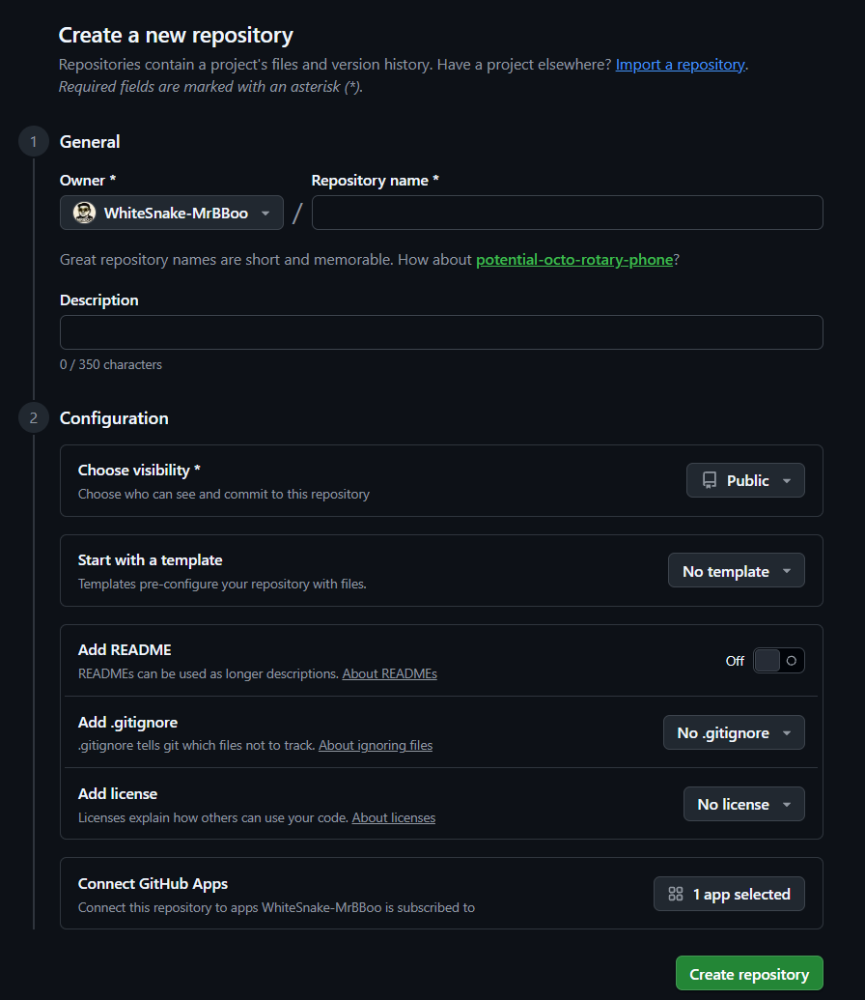

# 03. 로컬에서 GitHub까지 첫 실습

이 실습에서는 새 폴더를 Git 저장소로 만들고, 첫 커밋을 GitHub에 올린 뒤 양쪽 변경이 동기화되는지 확인합니다.

## 실습 결과

완료하면 다음 흐름을 직접 확인하게 됩니다.

```text
PowerShell에서 파일 생성
  → git init
  → git add
  → git commit
  → GitHub 원격 저장소 연결
  → git push
  → GitHub에서 수정
  → git pull
```

## 0. 실습 장소 만들기

기존 Git 저장소 안에 또 다른 Git 저장소를 만들면 초보자가 상태를 구분하기 어렵습니다. 먼저 현재 위치가 Git 저장소 안인지 확인합니다.

```powershell
Get-Location
git rev-parse --show-toplevel
```

두 번째 명령이 어떤 경로를 출력했다면 현재 위치는 이미 Git 저장소 안입니다. 아래 명령으로 **문서 폴더 아래의 별도 실습 공간**으로 이동합니다.

```powershell
$practiceRoot = Join-Path ([Environment]::GetFolderPath('MyDocuments')) 'git-practice'
New-Item -ItemType Directory -Path $practiceRoot -Force
Set-Location $practiceRoot
Get-Location
```

> OneDrive가 문서 폴더를 관리하는 PC에서는 실제 경로에 `OneDrive`가 포함될 수 있습니다. `Get-Location`에 표시된 경로가 의도한 실습 폴더라면 정상입니다.

## 1. 프로젝트 폴더와 파일 만들기

```powershell
New-Item -ItemType Directory -Path 'hello-git'
Set-Location 'hello-git'
```

`README.md` 파일을 만듭니다. `@'`와 `'@`는 각각 별도의 줄에 있어야 합니다.

```powershell
@'
# Hello Git

PowerShell로 Git과 GitHub를 연습하는 저장소입니다.
'@ | Set-Content -Encoding utf8 README.md
```

파일을 확인합니다.

```powershell
Get-ChildItem
Get-Content README.md
```

## 2. Git 저장소 시작하기

```powershell
git init -b main
git status
```

예상 상태:

- 현재 브랜치가 `main`입니다.
- 아직 커밋이 없습니다.
- `README.md`가 `Untracked files`에 표시됩니다.

`git init`은 현재 폴더에 숨김 폴더 `.git`을 만듭니다. 파일은 지우지 않지만, 이제부터 이 폴더의 변경 이력을 Git이 관리할 수 있습니다.

## 3. 첫 커밋 만들기

먼저 `README.md`를 스테이징합니다.

```powershell
git add README.md
git status
git diff --staged
```

`Changes to be committed`에 파일이 보이면 다음 커밋에 들어갈 준비가 된 것입니다.

```powershell
git commit -m "Add project README"
```

확인합니다.

```powershell
git status
git log --oneline
```

성공 기준:

- `git status`에 `working tree clean`이 표시됩니다.
- `git log --oneline`에 `Add project README` 커밋이 보입니다.

아직 GitHub에는 아무것도 올라가지 않았습니다. 지금까지는 모두 내 컴퓨터에서만 일어난 일입니다.

## 4. GitHub에 빈 저장소 만들기

1. GitHub에 로그인합니다.
2. 화면 오른쪽 위의 `+` 메뉴에서 **New repository**를 선택합니다.
3. Repository name에 `hello-git`을 입력합니다.
4. 처음 연습이라면 공개 범위를 **Private**로 선택해도 됩니다.
5. **Add a README file**, `.gitignore`, License 초기화 옵션은 모두 선택하지 않습니다.
6. **Create repository**를 누릅니다.



### 새 저장소 화면의 영문 항목 읽기

**Repository(리포지터리, 저장소)**는 프로젝트 파일과 Git 변경 이력을 보관하는 하나의 독립된 공간입니다. 화면의 별표 `*`는 반드시 입력하거나 선택해야 하는 필수 항목이라는 뜻입니다.

| 화면 항목 | 쉬운 한국어 뜻 | 초보자 설명과 선택 기준 |
|---|---|---|
| **Owner** | 소유자 | 저장소를 소유할 개인 계정 또는 Organization을 선택합니다. 소유자는 저장소 설정과 권한을 관리합니다. |
| **Repository name** | 저장소 이름 | GitHub 주소의 마지막 부분이 됩니다. 짧고 목적이 분명한 영문 이름을 권장합니다. 예: `hello-git`, `shopping-api`. |
| **Description** | 설명 | 프로젝트가 무엇인지 한 문장으로 적습니다. 선택 항목이지만 검색과 협업에 도움이 됩니다. |
| **Choose visibility** | 공개 범위 선택 | **Public**은 누구나 볼 수 있고 **Private**은 허용된 사용자만 볼 수 있습니다. 조직·요금제에 따라 **Internal**이 보일 수도 있습니다. |
| **Start with a template** | 템플릿으로 시작 | 기존 템플릿 저장소의 폴더와 파일 구조를 이용해 새 프로젝트를 만들 때 사용합니다. 첫 실습에서는 **No template**로 둡니다. |
| **Add README** | README 추가 | 프로젝트 소개 파일 `README.md`와 첫 커밋을 GitHub에서 자동 생성합니다. 로컬에 이미 커밋이 있으면 끕니다. |
| **Add .gitignore** | 제외 규칙 추가 | 로그, 빌드 결과, 가상환경처럼 Git이 추적하지 않을 파일 규칙을 언어·도구별 템플릿으로 만듭니다. |
| **Add license** | 사용 허가 조건 추가 | 다른 사람이 코드를 사용·수정·배포할 수 있는 조건을 명시합니다. 공개한다고 자동으로 자유 사용 허가가 생기는 것은 아닙니다. |
| **Connect GitHub Apps** | GitHub 앱 연결 | 계정에 설치된 자동화·외부 서비스 앱을 이 저장소에 연결합니다. 필요성을 모르면 선택하지 않아도 됩니다. |
| **Create repository** | 저장소 만들기 | 위 설정으로 독립된 GitHub 저장소를 실제 생성합니다. 누르기 전에 Owner와 공개 범위를 다시 확인합니다. |

### Public과 Private 중 무엇을 선택하나요?

| 상황 | 권장 시작점 | 이유 |
|---|---|---|
| 공개 포트폴리오·오픈소스 | **Public** | 누구나 코드를 확인할 수 있습니다. 비밀값과 개인정보가 없는지 먼저 검사해야 합니다. |
| 수업 연습·개인 메모·미공개 코드 | **Private** | 초대한 사용자만 볼 수 있어 처음 연습하기 편합니다. 그래도 비밀번호나 API 키를 커밋하면 안 됩니다. |
| 회사·학교 Organization 내부 공유 | 조직 정책 확인 | **Private** 또는 제공되는 경우 **Internal**을 조직 관리자의 지침에 따라 선택합니다. |

> 공개 범위는 나중에 바꿀 수 있지만 fork, GitHub Pages, Actions 로그, 보안 기능과 접근 권한 등에 영향이 생길 수 있습니다. 민감한 파일이 한 번이라도 Public 저장소에 push되었다면 나중에 Private으로 바꾸는 것만으로 유출이 해결되지는 않습니다.

### 초기화 옵션은 언제 켜나요?

```text
로컬에 이미 git init + commit이 있음
  → README / .gitignore / License를 GitHub에서 추가하지 않고 빈 저장소 생성

GitHub에서 완전히 새 프로젝트를 시작함
  → README를 추가해 첫 커밋 생성 가능
  → 필요한 언어의 .gitignore와 적절한 License 검토
```

로컬에 이미 첫 커밋이 있으므로 GitHub 저장소는 비어 있어야 연결이 가장 간단합니다. GitHub에서 README까지 만들면 로컬과 원격에 서로 다른 첫 커밋이 생길 수 있습니다.

공식 참고:

- [새 GitHub 저장소 만들기](https://docs.github.com/en/repositories/creating-and-managing-repositories/creating-a-new-repository)
- [저장소 README 안내](https://docs.github.com/en/repositories/managing-your-repositorys-settings-and-features/customizing-your-repository/about-readmes)
- [저장소 License 안내](https://docs.github.com/en/repositories/managing-your-repositorys-settings-and-features/customizing-your-repository/licensing-a-repository)

## 5. 로컬 저장소와 GitHub 연결하기

GitHub 저장소의 **Quick setup → HTTPS** 주소를 복사합니다. 주소는 다음 형태입니다.

```text
https://github.com/내-GitHub-사용자명/hello-git.git
```

PowerShell에서 자신의 주소를 따옴표 안에 넣습니다.

```powershell
$remoteUrl = 'https://github.com/내-GitHub-사용자명/hello-git.git'
git remote add origin $remoteUrl
git remote -v
```

`fetch`와 `push` 두 줄에 같은 GitHub 주소가 보이면 연결 정보가 등록된 것입니다. `origin`은 이 원격 저장소에 붙인 관례적인 별칭입니다.

> 반드시 `내-GitHub-사용자명`을 실제 사용자명으로 바꾸세요. 저장소 화면에서 복사한 URL을 그대로 쓰는 것이 가장 안전합니다.

## 6. 첫 push 하기

```powershell
git push -u origin main
```

- `push`: 로컬 커밋을 원격으로 전송합니다.
- `origin`: 보낼 원격 저장소의 별칭입니다.
- `main`: 보낼 로컬 브랜치입니다.
- `-u`: 로컬 `main`이 원격 `origin/main`을 기본 추적하도록 연결합니다.

첫 push에서 브라우저 로그인 창이 열리면 GitHub에 로그인하고 권한을 승인합니다. GitHub 계정 비밀번호를 PowerShell에 직접 입력하는 방식은 사용하지 않습니다.

GitHub 저장소 페이지를 새로 고쳐 다음을 확인합니다.

- `README.md`가 보입니다.
- `Add project README` 커밋이 보입니다.
- 기본 브랜치가 `main`입니다.

PowerShell에서도 연결을 확인합니다.

```powershell
git status
git branch -vv
```

`main` 옆에 `[origin/main]`이 보이면 추적 연결도 성공했습니다.

## 7. 두 번째 로컬 변경을 GitHub에 보내기

파일 끝에 한 줄을 추가합니다.

```powershell
Add-Content -Encoding utf8 README.md "`n## 학습 기록`n`n첫 push를 완료했습니다."
```

변경 내용을 확인한 뒤 커밋하고 push합니다.

```powershell
git status
git diff
git add README.md
git diff --staged
git commit -m "Record first push"
git push
```

첫 push에서 upstream을 설정했기 때문에 이제 `git push`만 입력해도 `origin/main`으로 전송됩니다. GitHub 페이지를 새로 고쳐 새 문장과 커밋을 확인합니다.

## 8. GitHub의 변경을 로컬로 받기

이번에는 반대 방향을 확인합니다.

1. GitHub 저장소에서 `README.md`를 엽니다.
2. 연필 모양의 편집 버튼을 누릅니다.
3. 맨 아래에 `GitHub 웹에서 작성한 문장입니다.`를 추가합니다.
4. Commit changes를 누르고 커밋 메시지를 `Edit README on GitHub`로 입력합니다.
5. 이 개인 실습에서는 `main`에 직접 커밋합니다.

로컬 PowerShell로 돌아와 실행합니다.

```powershell
git status
git pull --ff-only
Get-Content README.md
git log --oneline --decorate -5
```

`Get-Content` 결과에 GitHub에서 쓴 문장이 보이면 **GitHub → 로컬** 동기화도 성공했습니다.

`--ff-only`는 단순히 앞으로 이동할 수 있을 때만 pull하고, 예상하지 못한 병합 커밋은 자동 생성하지 않게 합니다. 명령이 중단되면 오류 메시지를 읽고 [문제 해결 문서](./07_문제해결과_안전수칙.md)를 확인하세요.

## 9. clone으로 원격 저장소 복제 확인하기

현재 저장소의 상위 실습 폴더로 이동하고, GitHub 저장소를 다른 이름으로 복제합니다.

```powershell
Set-Location $practiceRoot
git clone $remoteUrl 'hello-git-copy'
Set-Location 'hello-git-copy'
git status
git remote -v
Get-Content README.md
```

복제본에 파일, 커밋 이력, `origin` 연결이 함께 생깁니다. 이것이 단순 ZIP 다운로드와 `git clone`의 중요한 차이입니다.

clone, fork, ZIP, pull의 차이와 Private 저장소·특정 브랜치·submodule 복제를 더 자세히 연습하려면 [Clone(복제) 완전 가이드](./03_1_Clone_복제_가이드.md)를 이어서 확인하세요.

다음 브랜치 실습은 원본 폴더에서 진행합니다.

```powershell
Set-Location (Join-Path $practiceRoot 'hello-git')
git status
```

## 10. 완료 점검

- [ ] 로컬 폴더에 `git init -b main`을 실행했다.
- [ ] `add → commit`으로 첫 로컬 커밋을 만들었다.
- [ ] GitHub에는 README 없이 빈 `hello-git` 저장소를 만들었다.
- [ ] `origin`을 등록하고 `git push -u origin main`을 성공했다.
- [ ] 두 번째부터 `git push`만으로 전송했다.
- [ ] GitHub에서 만든 변경을 `git pull --ff-only`로 받았다.
- [ ] `git clone`으로 별도 복제본을 만들었다.

공식 참고: [로컬 코드를 GitHub에 추가하기](https://docs.github.com/en/migrations/importing-source-code/using-the-command-line-to-import-source-code/adding-locally-hosted-code-to-github)

이전: [설치와 GitHub 가입](./02_설치와_GitHub_가입.md) · 다음: [브랜치와 병합 실습](./04_브랜치와_병합_실습.md)
