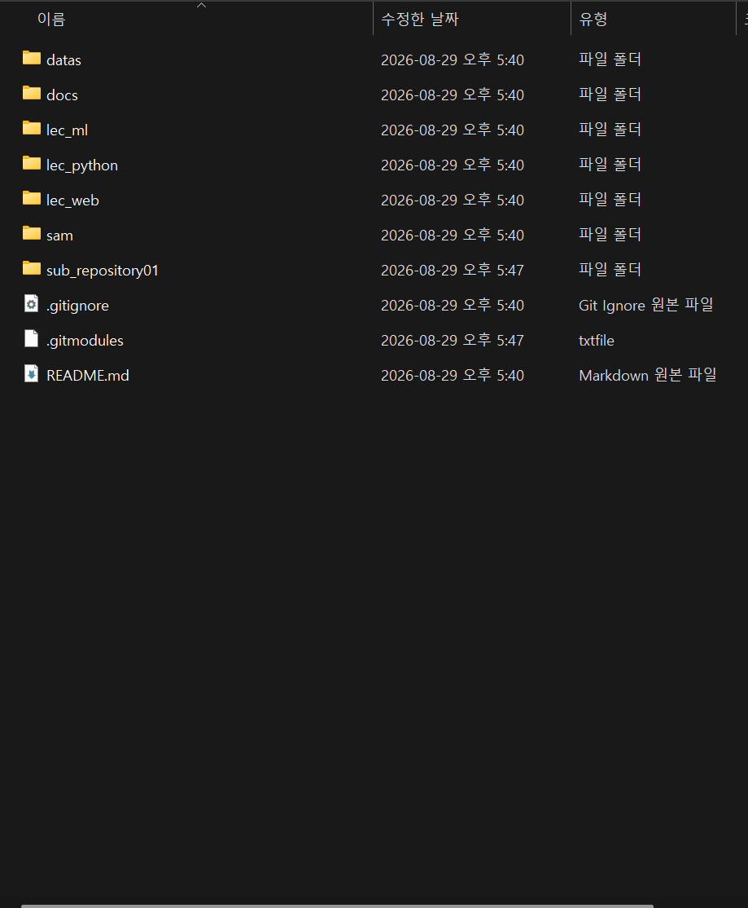
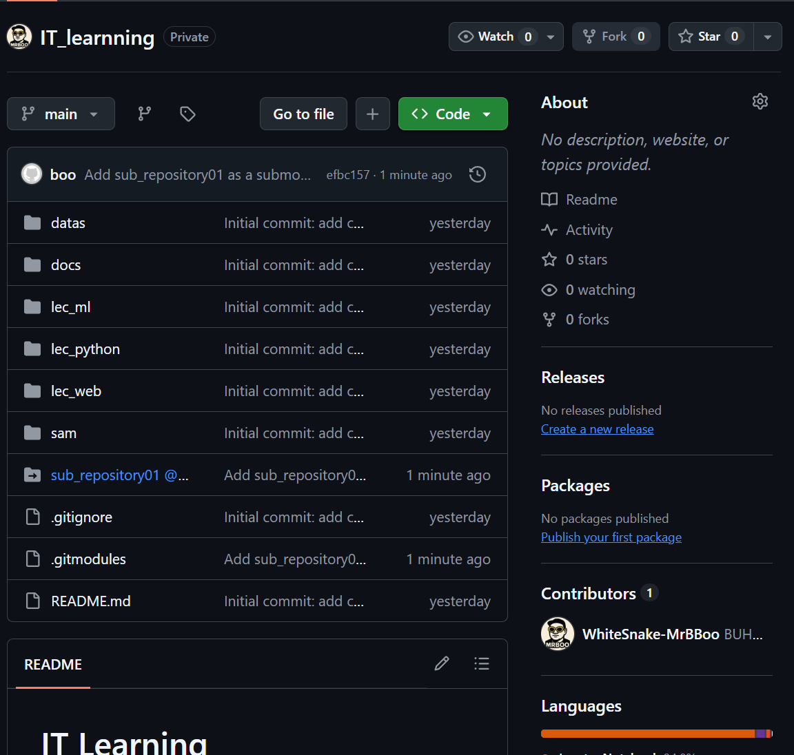
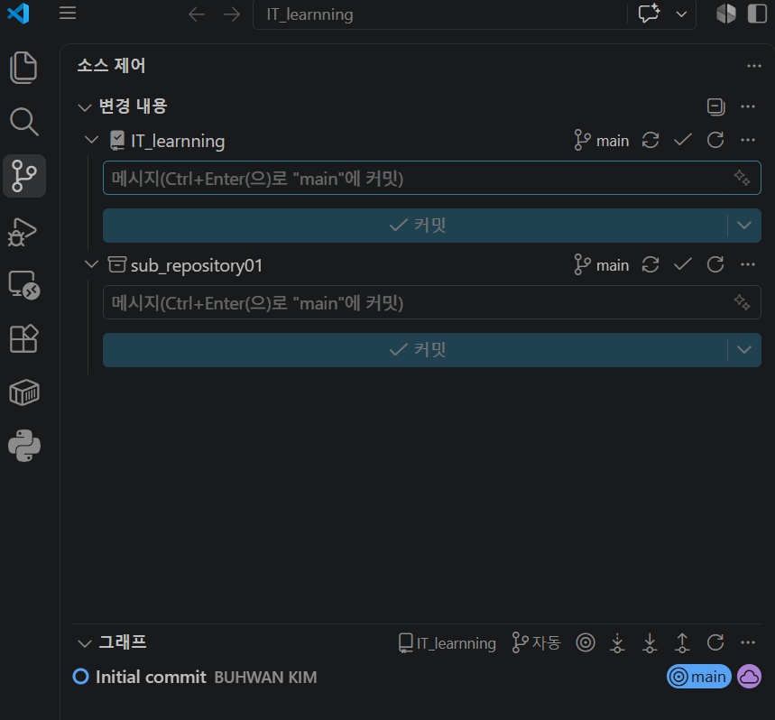

# 08. 저장소 구조와 Submodule 심화 가이드

이 장에서는 “폴더 하나가 곧 GitHub 저장소인가?”, “여러 프로젝트를 한 저장소에 넣어도 되는가?”, “submodule은 왜 일반 폴더와 다르게 보이는가?”를 실제 `IT_learrning` 화면을 바탕으로 설명합니다.

## 1. 가장 먼저 잡아야 할 단위

GitHub에서 독립적으로 관리되는 기본 단위는 **repository(저장소)**입니다. 저장소마다 다음 항목이 별도로 존재합니다.

- 커밋 이력과 브랜치
- 원격 URL과 접근 권한
- Issues, Pull Requests, Actions
- Releases, Tags, Settings
- 공개·비공개 여부

내 PC의 폴더와 GitHub 저장소는 자동으로 1:1이 되지 않습니다.

```text
일반 폴더
  └─ 파일을 분류하는 디렉터리일 뿐

Git 저장소 폴더
  ├─ 프로젝트 파일
  └─ .git             ← 독립 커밋 이력

GitHub 저장소
  └─ push/pull 대상이 되는 독립 원격 저장소
```

하나의 Git 저장소 안에는 일반 폴더를 여러 개 둘 수 있습니다. 이 폴더들은 모두 **같은 저장소의 같은 커밋 이력**에 포함됩니다.

## 2. 네 가지 프로젝트 관리 구조 비교

| 구조 | 로컬 `.git` 수 | GitHub 저장소 수 | clone 난이도 | 이력·권한 | 적합한 경우 |
|---|---:|---:|---|---|---|
| 한 저장소 + 일반 폴더 | 루트에 1개 | 1개 | 가장 단순 | 모두 함께 관리 | 같은 수업·제품·배포 주기 |
| 상위 작업 폴더 + 독립 저장소들 | 각 자식에 1개씩 | 여러 개 | 저장소별 clone | 완전히 독립 | 서로 무관하거나 담당·권한이 다름 |
| 부모 저장소 + submodule | 부모와 각 자식에 각각 존재 | 여러 개 | 재귀 초기화 필요 | 독립 이력 + 부모가 자식 버전 고정 | 독립 프로젝트를 정확한 버전으로 조합 |
| subtree 또는 소스 복사 | 부모에 1개 | 보통 1개 이상 | 소비자는 단순 | 부모 이력에 파일 포함 | 단순 clone이 중요하고 동기화 복잡성을 감수할 때 |

선택 기준은 “폴더가 몇 개인가?”가 아니라 다음 질문입니다.

1. 변경과 배포를 항상 같이 하는가?
2. 접근 권한과 담당자가 같은가?
3. Issue와 Pull Request를 한곳에서 관리해야 하는가?
4. 한 프로젝트를 여러 부모 프로젝트가 재사용하는가?
5. 부모가 자식의 **정확한 커밋 버전**을 고정해야 하는가?

## 3. 구조 A: 한 저장소 안의 일반 프로젝트 폴더

예를 들어 한 교육 저장소가 다음과 같을 수 있습니다.

```text
IT_learrning/
├─ .git/
├─ docs/
├─ lec_python/
├─ lec_ml/
└─ lec_web/
```

`docs`, `lec_python`, `lec_ml`, `lec_web`은 별도 저장소가 아니라 `IT_learrning` 저장소의 일반 폴더입니다.

```powershell
git add .\docs .\lec_python .\lec_ml .\lec_web
git commit -m "Update course projects"
git push
```

한 커밋이 여러 폴더의 변경을 함께 포함할 수 있고, GitHub에서도 모두 일반 폴더 아이콘으로 보입니다. 여러 프로젝트를 한 저장소에서 관리하면 흔히 **monorepo(모노레포)**라고 부릅니다.

### 장점

- clone, pull, branch, PR이 한 번씩이면 됩니다.
- 여러 폴더를 함께 바꾸는 커밋을 원자적으로 만들 수 있습니다.
- 공통 문서·설정·자동화 구성이 쉽습니다.
- 초보자가 구조를 이해하기 가장 단순합니다.

### 단점

- 프로젝트별 권한과 공개 범위를 나누기 어렵습니다.
- 저장소가 커질수록 clone과 자동 테스트 범위가 커질 수 있습니다.
- Issue, Release, 버전 정책이 한 저장소에 모입니다.

### 권장 상황

- 같은 수업 과정의 자료
- 함께 배포되는 웹 프런트엔드와 백엔드
- 공통 정책과 담당자를 가진 작은 프로젝트 모음

## 4. 구조 B: 상위 작업 폴더에 독립 저장소를 나란히 배치

상위 폴더 자체는 Git 저장소가 아니고, 각 프로젝트만 독립 저장소인 구조입니다.

```text
github-projects/              ← 일반 작업 공간, .git 없음
├─ project-a/
│  └─ .git/
├─ project-b/
│  └─ .git/
└─ shared-library/
   └─ .git/
```

각 저장소를 별도로 clone합니다.

```powershell
$workspaceRoot = Join-Path ([Environment]::GetFolderPath('MyDocuments')) 'github-projects'
New-Item -ItemType Directory -Path $workspaceRoot -Force
Set-Location $workspaceRoot

git clone 'https://github.com/사용자명/project-a.git'
git clone 'https://github.com/사용자명/project-b.git'
git clone 'https://github.com/사용자명/shared-library.git'
```

### 장점

- 저장소마다 권한, 공개 범위, Issue, Release를 완전히 분리합니다.
- 프로젝트별 배포 주기와 버전을 유지할 수 있습니다.
- 한 저장소의 변경이 다른 저장소의 상태로 표시되지 않습니다.

### 단점

- clone, pull, branch, push를 저장소별로 수행합니다.
- 여러 저장소가 함께 동작하는 정확한 버전 조합을 별도로 기록해야 합니다.
- 상위 작업 폴더를 GitHub에 push한다고 자식 저장소들이 한 번에 올라가지는 않습니다.

### 권장 상황

- 서로 관련이 적은 개인 프로젝트들
- 담당자·보안 권한·배포 시점이 다른 서비스들
- 각각 독립된 제품이나 라이브러리

## 5. 피해야 할 구조: 설명 없이 중첩된 Git 저장소

부모 Git 저장소 안에 `.git`을 가진 다른 저장소 폴더를 그냥 복사한 뒤 `git add`하면 Git이 `embedded git repository` 경고를 표시할 수 있습니다.

```text
parent-repo/
├─ .git/
└─ child-repo/
   └─ .git/       ← 부모에 설명 없이 중첩
```

이 상태는 일반 폴더도 아니고 완전한 submodule 설정도 아닐 수 있습니다. 부모를 clone한 사람은 자식 저장소의 URL을 알 수 없어 파일을 정상적으로 받지 못할 수 있습니다.

의도를 먼저 결정하세요.

- 한 저장소로 합칠 것이라면 자식의 독립 Git 이력을 어떻게 보존할지 계획하고 일반 폴더로 통합합니다.
- 독립 저장소를 유지할 것이라면 정식 `git submodule add`를 사용합니다.
- 서로 관계가 없다면 부모 저장소 밖의 상위 작업 공간에 나란히 둡니다.

자식의 `.git`을 삭제하면 독립 이력과 설정을 잃을 수 있으므로 백업·원격 push·이력 보존 방법을 확인하기 전에는 삭제하지 마세요.

## 6. 구조 C: submodule이란?

submodule은 부모 저장소 안의 경로에 **다른 Git 저장소를 연결**하는 기능입니다.

```text
부모 저장소 IT_learrning
├─ 부모의 커밋 이력
├─ .gitmodules ───────────────┐
└─ sub_repository01 ──────────┼─ 자식 저장소 URL + 경로
                              └─ 부모가 사용할 자식의 정확한 커밋 ID

자식 저장소 sub_repository01
└─ 자체 커밋·브랜치·GitHub 저장소
```

부모 저장소는 자식의 모든 파일을 자신의 파일처럼 커밋하지 않습니다. 대신 다음 두 정보를 기록합니다.

1. `.gitmodules`: submodule의 이름, 로컬 경로, 원격 URL
2. gitlink: 부모가 사용할 자식 저장소의 **특정 커밋 ID**

따라서 부모 커밋은 “`sub_repository01`의 최신 버전”이 아니라 “`sub_repository01`의 정확히 이 커밋”을 가리킵니다.

## 7. 현재 `IT_learrning` 사례 읽기

현재 `.gitmodules`는 다음 의미를 가집니다.

```ini
[submodule "sub_repository01"]
    path = sub_repository01
    url = https://github.com/WhiteSnake-MrBBoo/sub_repository01.git
```

- 부모 저장소: `IT_learrning`
- 자식 저장소: `sub_repository01`
- 내 PC에서 보이는 위치: `IT_learrning\sub_repository01`
- 자식 원격 저장소: `WhiteSnake-MrBBoo/sub_repository01`

> 이 submodule은 이미 등록되어 있습니다. 현재 `IT_learrning`에서 같은 경로로 `git submodule add`를 다시 실행하지 마세요.

### Windows 탐색기 화면



Windows 탐색기에서는 `sub_repository01`이 일반 폴더처럼 보입니다. 그러나 `.gitmodules`가 함께 있고 내부 Git 메타데이터도 연결되어 있으므로 Git 관점에서는 독립 저장소입니다.

### GitHub 저장소 화면



GitHub에서 `sub_repository01 @ ...` 형태와 화살표가 붙은 폴더 아이콘은 일반 디렉터리가 아니라 gitlink임을 나타냅니다. 클릭하면 부모가 가리키는 자식 저장소의 커밋으로 이동합니다.

### VS Code 소스 제어 화면



VS Code가 `IT_learrning`과 `sub_repository01`을 별도 소스 제어 항목으로 표시하는 것은 정상입니다. 두 저장소는 각각 별도 커밋이 필요합니다.

## 8. 새 submodule 추가 순서

다음은 아직 등록되지 않은 새 자식 저장소를 추가할 때의 일반 순서입니다. 먼저 GitHub에 자식 저장소가 존재하고 접근 권한이 있어야 합니다.

```powershell
Set-Location 'C:\경로\부모-저장소'
git status

$submoduleUrl = 'https://github.com/사용자명/shared-library.git'
git submodule add $submoduleUrl 'shared-library'
```

생긴 변경을 확인합니다.

```powershell
git status
Get-Content .gitmodules
git diff --cached --submodule
git submodule status
```

보통 `.gitmodules`와 `shared-library` gitlink가 stage됩니다. 부모 저장소에서 커밋하고 push합니다.

```powershell
git commit -m "Add shared-library as a submodule"
git push
```

URL이나 경로를 잘못 입력했다면 무작정 폴더를 삭제하지 말고, 커밋 여부와 `git status`를 확인한 뒤 submodule 제거 절차를 별도로 검토하세요.

## 9. submodule 저장소 clone

처음부터 부모와 모든 자식을 함께 준비합니다.

```powershell
$parentUrl = 'https://github.com/사용자명/부모-저장소.git'
git clone --recurse-submodules $parentUrl
```

이미 부모만 clone했다면 다음을 실행합니다.

```powershell
git submodule update --init --recursive
git submodule status --recursive
```

부모와 자식이 모두 Private이면 로그인 계정이 각 저장소에 접근할 수 있어야 합니다.

## 10. submodule 수정과 push의 정확한 순서

가장 중요한 원칙입니다.

```text
1. 자식 저장소에서 수정
2. 자식 저장소에서 add → commit → push
3. 부모 저장소에서 변경된 자식 커밋 포인터를 add → commit → push
```

### 10-1. 자식 저장소 작업

submodule은 clone/update 직후 detached HEAD일 수 있습니다. 수정 전에 브랜치로 이동합니다.

```powershell
Set-Location .\sub_repository01
git status
git switch main
git pull --ff-only
```

파일을 수정한 뒤 자식 저장소에 커밋하고 **먼저 push**합니다.

```powershell
git status
git diff
git add README.md
git diff --staged
git commit -m "Update submodule README"
git push
```

### 10-2. 부모 저장소가 새 자식 버전을 기록

부모로 돌아가면 submodule 경로가 변경된 것으로 보입니다.

```powershell
Set-Location ..
git status
git diff --submodule
git add .\sub_repository01
git commit -m "Update sub_repository01 revision"
git push
```

부모는 자식 파일 내용을 다시 저장한 것이 아니라 새 자식 커밋 ID를 기록했습니다.

> 순서를 반대로 하지 마세요. 부모가 가리키는 자식 커밋을 먼저 push하지 않으면 다른 사람이 그 커밋을 내려받지 못할 수 있습니다.

## 11. 다른 사람이 부모의 최신 상태를 받을 때

부모 커밋을 pull한 다음 부모가 지정한 자식 커밋으로 맞춥니다.

```powershell
git pull --ff-only
git submodule update --init --recursive
git submodule status --recursive
```

이 명령은 자식 저장소를 무조건 최신 `main`으로 올리는 것이 아니라 **부모가 기록한 커밋**으로 맞춥니다. 이 고정 동작이 submodule의 핵심 장점입니다.

## 12. submodule 상태 읽기

```powershell
git submodule status --recursive
```

커밋 ID 앞 문자의 대표 의미:

| 표시 | 의미 |
|---|---|
| 공백 | 초기화되어 있고 부모가 기록한 커밋과 일치 |
| `-` | 아직 초기화되지 않음 |
| `+` | 현재 자식 커밋이 부모가 기록한 커밋과 다름 |
| `U` | submodule 커밋 충돌이 있음 |

부모에서 다음 명령도 함께 사용하면 원인을 찾기 쉽습니다.

```powershell
git status
git diff --submodule
git -C .\sub_repository01 status
git -C .\sub_repository01 log --oneline --decorate -5
```

`git -C <경로>`는 현재 폴더를 옮기지 않고 해당 저장소에서 Git 명령을 실행합니다.

## 13. submodule을 선택할 때의 장단점

### 장점

- 자식 프로젝트가 독립 이력·브랜치·Release·권한을 유지합니다.
- 여러 부모 프로젝트가 같은 자식 저장소를 재사용할 수 있습니다.
- 부모가 검증한 자식의 정확한 커밋을 고정할 수 있습니다.
- 자식 저장소를 독립적으로 배포할 수 있습니다.

### 단점

- clone 후 초기화와 업데이트 절차가 추가됩니다.
- 부모와 자식을 각각 커밋·push해야 합니다.
- detached HEAD와 커밋 포인터 개념을 이해해야 합니다.
- Private submodule마다 접근 권한이 필요합니다.
- GUI 도구에서 submodule 전용 작업이 제한적일 수 있습니다.

### 사용을 권장하는 경우

- 독립 배포되는 공통 라이브러리
- 여러 제품이 공유하지만 제품마다 검증 버전을 고정해야 하는 모듈
- 권한과 책임자가 부모 프로젝트와 다른 구성 요소

### 일반 폴더가 더 나은 경우

- 항상 함께 수정하고 함께 배포하는 작은 프로젝트
- 별도 Issue·Release·권한이 필요하지 않은 수업 자료
- 초보 팀이 단순한 clone과 한 번의 PR 흐름을 우선할 때

## 14. GitHub Desktop과 VS Code에서 관리할 때

- 부모와 submodule을 **서로 다른 저장소**라고 생각합니다.
- 자식 변경은 자식 저장소 화면에서 먼저 커밋하고 push합니다.
- 부모 저장소 화면으로 돌아와 변경된 submodule 커밋 포인터를 커밋하고 push합니다.
- submodule 추가·초기화·정확한 상태 확인은 PowerShell의 Git 명령이 더 명확합니다.
- GUI에서 `Discard changes`를 누르기 전에 대상이 일반 파일인지 submodule 포인터인지 반드시 확인합니다.

GitHub Desktop의 일반 사용법과 submodule 병행 방법은 [GitHub Desktop 사용 가이드](./09_GitHub_Desktop_사용_가이드.md)를 참고하세요.

## 15. 구조 선택 빠른 판단표

| 질문 | 예 | 아니요 |
|---|---|---|
| 항상 함께 수정·배포하는가? | 한 저장소의 일반 폴더 | 다음 질문 |
| 권한·Issue·Release가 달라야 하는가? | 독립 저장소 | 한 저장소 검토 |
| 부모가 자식의 정확한 버전을 고정해야 하는가? | submodule 검토 | 나란한 독립 저장소 검토 |
| 여러 부모가 같은 자식을 재사용하는가? | submodule 또는 패키지화 검토 | 일반 폴더가 단순할 수 있음 |
| 사용자가 재귀 clone을 몰라도 바로 써야 하는가? | 일반 폴더·패키지·subtree 검토 | submodule 가능 |

코드 라이브러리라면 submodule 외에 패키지 저장소(PyPI, npm, Maven 등)로 배포하는 방법도 있습니다. 재사용 코드의 배포·버전 관리가 목적이라면 패키지 방식이 더 자연스러울 수 있습니다.

## 16. 완료 점검

- [ ] GitHub의 독립 관리 단위가 저장소임을 설명할 수 있다.
- [ ] 일반 폴더, 나란한 독립 저장소, submodule의 차이를 설명할 수 있다.
- [ ] GitHub에서 화살표와 `@커밋`이 submodule 포인터임을 안다.
- [ ] VS Code에 부모와 자식이 따로 표시되는 이유를 안다.
- [ ] `.gitmodules`와 부모가 기록한 커밋 ID의 역할을 구분한다.
- [ ] 자식 commit·push 후 부모 포인터 commit·push 순서를 지킬 수 있다.
- [ ] clone 뒤 `git submodule update --init --recursive`를 실행할 수 있다.
- [ ] 현재 `sub_repository01`에는 `git submodule add`를 다시 실행하면 안 됨을 안다.

공식 참고: [Git submodule 명령](https://git-scm.com/docs/git-submodule) · [Pro Git의 Submodules 장](https://git-scm.com/book/en/v2/Git-Tools-Submodules) · [Git clone의 재귀 submodule 옵션](https://git-scm.com/docs/git-clone.html)

이전: [문제 해결과 안전 수칙](./07_문제해결과_안전수칙.md) · 다음: [GitHub Desktop 사용 가이드](./09_GitHub_Desktop_사용_가이드.md)
