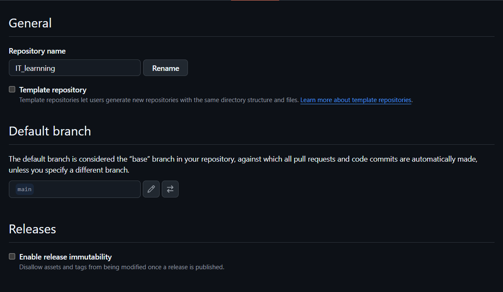
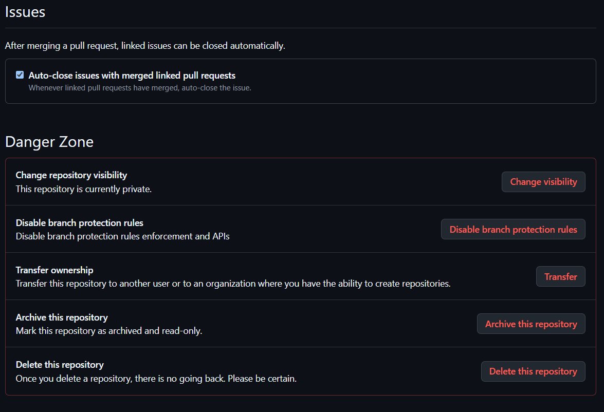

# 10. GitHub 심화 운영 가이드

Git 명령으로 파일 이력을 관리할 수 있게 되면, 다음 단계는 GitHub 저장소를 **안전하고 협업하기 좋은 프로젝트 공간**으로 운영하는 것입니다. 이 장은 모든 기능을 당장 적용하는 목록이 아니라, 저장소가 성장할 때 무엇을 어떤 순서로 검토할지 알려 주는 참고서입니다.

## 1. GitHub 저장소 하나가 관리하는 범위

GitHub의 다음 기능은 기본적으로 저장소별로 독립되어 있습니다.

```text
Repository
├─ Code: 파일, 커밋, 브랜치, 태그
├─ Issues: 버그·할 일·논의
├─ Pull requests: 변경 검토와 병합
├─ Actions: 테스트·빌드·배포 자동화
├─ Security: 취약점·의존성·비밀 노출 관리
├─ Releases: 사용자에게 배포할 버전
└─ Settings: 권한, 규칙, 공개 범위, 기능 설정
```

submodule의 부모와 자식은 각각 별도 GitHub 저장소이므로 위 기능도 각각 따로 존재합니다. 부모 PR에는 보통 자식 파일의 실제 diff가 아니라 자식 커밋 포인터 변경이 표시됩니다.

## 2. 저장소 첫 화면 정리

처음 방문한 사람이 1분 안에 저장소를 이해하도록 다음 항목부터 갖춥니다.

| 항목 | 역할 | 권장 내용 |
|---|---|---|
| Description | 저장소 한 줄 설명 | 무엇을 위한 프로젝트인지 |
| Topics | 검색·분류용 키워드 | `python`, `learning`, `git` 등 |
| `README.md` | 대표 사용 설명서 | 목적, 설치, 실행, 구조, 문의 방법 |
| `.gitignore` | 불필요·민감 파일 제외 | 언어·도구에 맞는 패턴 |
| `LICENSE` | 사용·배포 조건 | 공개 저장소라면 특히 중요 |
| `CONTRIBUTING.md` | 기여 절차 | 브랜치, 테스트, PR 규칙 |
| `SECURITY.md` | 보안 취약점 제보 방법 | 공개 Issue 대신 안전한 연락 절차 |
| `CODE_OF_CONDUCT.md` | 커뮤니티 행동 규칙 | 외부 기여가 있는 프로젝트에 유용 |

Public 저장소라고 해서 다른 사람이 자동으로 자유롭게 복사·배포·수정할 권리를 얻는 것은 아닙니다. 공개 프로젝트라면 목적에 맞는 License를 명시합니다.

## 3. 저장소 공개 범위와 권한

### Public

- 누구나 코드를 볼 수 있습니다.
- 검색과 포트폴리오, 오픈소스 협업에 적합합니다.
- 비밀번호·API 키·개인 정보는 절대 포함하면 안 됩니다.

### Private

- 허용된 사용자와 팀만 접근할 수 있습니다.
- 수업 과제, 회사 코드, 개인 실험에 적합할 수 있습니다.
- Private도 비밀 관리 도구를 대신하지 않습니다. 민감 정보는 커밋하지 않습니다.

### 권한을 나눌 때

- 개인 저장소는 필요한 사람만 collaborator로 초대합니다.
- 팀이 커지면 Organization과 Team으로 권한을 묶어 관리합니다.
- 최소 권한 원칙을 적용해 읽기만 필요한 사람에게 쓰기 권한을 주지 않습니다.
- 퇴사·수업 종료·협업 종료 시 접근 권한과 토큰을 정리합니다.

부모 저장소와 Private submodule은 권한이 별개입니다. 부모 접근 권한만으로 자식 저장소가 자동으로 열리지 않습니다.

### 저장소 Settings와 개인 Settings는 다릅니다

GitHub에는 이름이 같은 **Settings(설정)**가 두 종류 있어 초보자가 자주 혼동합니다.

```text
오른쪽 위 프로필 사진 → Settings
  = 내 GitHub 계정 전체의 프로필·이메일·비밀번호·2FA 설정

특정 Repository 열기 → 위쪽 Settings 탭
  = 그 저장소 하나의 이름·브랜치·권한·기능·보안 설정
```

저장소의 **Settings** 탭이 보이지 않으면 메뉴가 접혀 있는지 확인합니다. 저장소에 대한 관리자 권한이 없으면 일부 설정이나 Settings 탭 자체가 보이지 않을 수 있습니다.

### 저장소 Settings 카테고리 지도

GitHub 화면, 계정 권한, 저장소 종류와 요금제에 따라 메뉴 이름과 제공 항목은 달라질 수 있지만 다음 범주를 먼저 이해하면 됩니다.

| 대표 카테고리 | 쉬운 뜻 | 주요 용도 |
|---|---|---|
| **General** | 일반 설정 | 저장소 이름, 기본 브랜치, Issue·Pull Request·Wiki 기능, 병합 방식과 Danger Zone 등을 관리합니다. |
| **Collaborators / Access** | 공동 작업자·접근 권한 | 누가 저장소를 읽고 수정하거나 관리할 수 있는지 정합니다. 개인 저장소와 Organization 저장소의 권한 화면은 다를 수 있습니다. |
| **Branches / Rules / Rulesets** | 브랜치와 보호 규칙 | `main` 직접 push 금지, PR·리뷰·테스트 요구, 강제 push 차단 같은 정책을 설정합니다. |
| **Actions** | 자동화 | 어떤 GitHub Actions workflow를 실행할 수 있는지와 실행 권한을 관리합니다. |
| **Webhooks** | 외부 알림 연결 | push·Issue·PR 같은 사건이 생겼을 때 외부 서버로 HTTP 알림을 전송합니다. 초보 실습에는 필요하지 않습니다. |
| **Pages** | 웹사이트 공개 | 저장소의 정적 파일을 GitHub Pages 사이트로 게시할 소스와 도메인을 설정합니다. |
| **Environments** | 배포 환경 | 개발·검증·운영 환경별 승인, Secret, 배포 보호 규칙을 관리합니다. |
| **Security / Code security and analysis** | 코드 보안 | Dependabot, code scanning, secret scanning 등 저장소 보안 기능을 확인합니다. |
| **Secrets and variables** | 비밀값과 변수 | Actions 등에 필요한 토큰과 환경값을 저장합니다. Secret 값은 저장 후 다시 평문으로 확인할 수 없으므로 별도로 안전하게 관리합니다. |
| **Deploy keys** | 배포용 SSH 키 | 특정 저장소에 접근하는 서버용 SSH 공개 키를 등록합니다. 일반 사용자 로그인 키와 목적이 다릅니다. |
| **Integrations** | 외부 서비스 연동 | GitHub Apps, 이메일 알림, 자동 링크 등 다른 도구와의 연결을 관리합니다. |

처음부터 모든 설정을 바꿀 필요는 없습니다. 개인 학습 저장소는 **General → 공개 범위와 기본 브랜치**, **Access → 공동 작업자**, **Rules → main 보호**, **Security → 비밀 노출 여부** 순서로 익히면 충분합니다.

### General 상단: 이름·템플릿·기본 브랜치·Release



| 화면 항목 | 뜻 | 변경 전 확인할 점 |
|---|---|---|
| **Repository name** | 저장소 이름 | 바꾸면 GitHub URL도 달라집니다. 기존 주소가 리디렉션될 수 있어도 혼동을 막기 위해 로컬에서 `git remote set-url origin <새-URL>`로 갱신하는 것이 좋습니다. |
| **Template repository** | 템플릿 저장소 | 체크하면 다른 사용자가 이 저장소의 파일·폴더 구조를 바탕으로 별도의 새 저장소를 만들 수 있습니다. submodule이나 fork와 같은 기능이 아닙니다. |
| **Default branch** | 기본 브랜치 | 새 PR과 웹 편집의 기본 기준 브랜치입니다. 보통 `main`을 사용합니다. 이름만 바꾸는 기능과 기본 브랜치를 다른 기존 브랜치로 선택하는 기능을 구분합니다. |
| **Release immutability** | Release 불변성 | 게시한 Release의 태그와 자산 변경을 제한해 배포 결과의 신뢰성을 높이는 기능입니다. 실제 배포 정책을 정한 뒤 사용합니다. |

기본 브랜치를 `develop`이나 작업 브랜치로 무심코 바꾸면 새 Pull Request의 대상이 달라질 수 있습니다. 변경 직후 저장소 첫 화면의 브랜치 표시와 새 PR의 **base**를 반드시 확인합니다.

공식 참고:

- [기본 브랜치 변경](https://docs.github.com/en/repositories/configuring-branches-and-merges-in-your-repository/managing-branches-in-your-repository/changing-the-default-branch)
- [저장소 이름 변경](https://docs.github.com/en/repositories/creating-and-managing-repositories/renaming-a-repository)
- [템플릿에서 저장소 만들기](https://docs.github.com/en/repositories/creating-and-managing-repositories/creating-a-repository-from-a-template)

### Issues와 Danger Zone



#### Auto-close issues with merged linked pull requests

**병합된 연결 PR로 Issue 자동 닫기**라는 뜻입니다. 활성화하면 기본 브랜치에 병합된 Pull Request와 연결된 Issue가 자동으로 닫힐 수 있습니다.

PR 본문에서 다음과 같은 종료 키워드로 Issue를 연결할 수 있습니다.

```text
Closes #12
Fixes #12
Resolves #12
```

단순히 `#12`만 적는 것과 종료 키워드를 사용하는 것은 의미가 다릅니다. 병합 전에 정말 해결된 Issue인지 확인하세요.

공식 참고: [Pull Request와 Issue 연결](https://docs.github.com/en/issues/tracking-your-work-with-issues/using-issues/linking-a-pull-request-to-an-issue)

#### Danger Zone은 왜 빨간색인가요?

**Danger Zone(위험 구역)**에는 저장소 접근·소유권·보존 상태를 크게 바꾸거나 데이터를 삭제하는 기능이 모여 있습니다. 버튼을 시험 삼아 누르지 말고 다음 영향을 먼저 확인합니다.

| 화면 항목 | 쉬운 뜻 | 핵심 주의사항 |
|---|---|---|
| **Change repository visibility** | 공개 범위 변경 | Private → Public이면 코드와 일부 활동·Actions 로그가 공개될 수 있습니다. Public → Private도 기존 fork·복제본이 사라진다는 뜻은 아닙니다. |
| **Disable branch protection rules** | 브랜치 보호 해제 | 직접 push, 강제 push, 삭제 등을 막던 보호가 약해질 수 있습니다. 작업이 막힌다는 이유만으로 해제하지 말고 규칙과 권한을 먼저 확인합니다. |
| **Transfer ownership** | 소유권 이전 | 저장소를 다른 사용자나 Organization으로 넘깁니다. 권한, Pages, Packages, Actions, Secret, 로컬 `origin` 주소에 미치는 영향을 확인합니다. |
| **Archive this repository** | 저장소 보관 처리 | 더 이상 적극적으로 관리하지 않는 저장소를 읽기 전용으로 보존합니다. 삭제보다 먼저 검토할 수 있으며 필요하면 권한이 있는 관리자가 해제할 수 있습니다. |
| **Delete this repository** | 저장소 삭제 | 코드뿐 아니라 Issue, PR, 설정과 연결 기능에 큰 영향을 줍니다. 로컬 clone이 있다고 해서 GitHub의 모든 메타데이터가 백업되는 것은 아닙니다. 가장 마지막 수단입니다. |

Danger Zone 작업 전 최소 점검:

- [ ] 정확한 Owner와 Repository name을 다시 확인했다.
- [ ] 아직 push하지 않은 로컬 커밋이 없는지 확인했다.
- [ ] 열려 있는 Issue·PR, Release, Packages, Pages, Actions와 Secret 영향을 확인했다.
- [ ] submodule 또는 다른 저장소가 이 URL을 참조하는지 확인했다.
- [ ] 팀 저장소라면 관리자와 공동 작업자에게 변경을 알리고 승인받았다.
- [ ] 삭제보다 Archive 또는 권한 조정으로 목적을 달성할 수 없는지 검토했다.

공식 참고:

- [저장소 공개 범위 변경](https://docs.github.com/en/repositories/managing-your-repositorys-settings-and-features/managing-repository-settings/setting-repository-visibility)
- [저장소 이전](https://docs.github.com/en/repositories/creating-and-managing-repositories/transferring-a-repository)
- [저장소 보관](https://docs.github.com/en/repositories/archiving-a-github-repository/archiving-repositories)
- [저장소 삭제](https://docs.github.com/en/repositories/creating-and-managing-repositories/deleting-a-repository)

## 4. 기본 브랜치 보호와 Ruleset

중요한 `main` 브랜치에는 직접 push 대신 Pull Request를 거치게 하는 규칙을 고려합니다.

GitHub 저장소의 **Settings → Rules → Rulesets** 또는 브랜치 보호 설정에서 다음 규칙을 검토할 수 있습니다. 메뉴와 제공 범위는 계정·요금제·저장소 종류에 따라 다를 수 있습니다.

- 병합 전 Pull Request 요구
- 필요한 승인 리뷰 수 지정
- 새 커밋이 올라오면 오래된 승인 무효화
- 리뷰 대화 해결 요구
- 필수 테스트·상태 검사 통과 요구
- 강제 push와 브랜치 삭제 차단
- 선형 이력, 서명된 커밋 등 추가 정책

초보 팀의 시작 권장안:

```text
대상: main
필수: Pull Request
필수: 리뷰 1명 이상(혼자라면 생략 가능)
필수: 설정된 테스트 통과
차단: force push
차단: main 삭제
```

규칙을 먼저 너무 엄격하게 만들면 첫 PR도 병합하지 못할 수 있습니다. 자동 테스트가 실제로 성공한 적이 있는지 확인한 뒤 필수 상태 검사로 지정하세요.

공식 참고: [GitHub Ruleset에서 사용할 수 있는 규칙](https://docs.github.com/en/repositories/configuring-branches-and-merges-in-your-repository/managing-rulesets/available-rules-for-rulesets)

## 5. Pull Request 품질 높이기

좋은 PR은 변경 크기가 작고 목적과 검증 방법이 분명합니다.

### 제목

```text
Add Windows clone guide
Fix login redirect loop
Update submodule revision
```

### 본문 기본 구조

```markdown
## 변경 내용

- 무엇을 변경했는지 적습니다.

## 변경 이유

- 왜 필요한지 적습니다.

## 확인 방법

- 실행한 테스트나 화면 확인을 적습니다.

## 관련 Issue

- Closes #12
```

`.github/pull_request_template.md`를 기본 브랜치에 추가하면 새 PR 본문에 같은 형식을 자동으로 제공합니다.

공식 참고: [Issue와 Pull Request 템플릿](https://docs.github.com/en/communities/using-templates-to-encourage-useful-issues-and-pull-requests)

## 6. CODEOWNERS와 리뷰 담당자

`.github/CODEOWNERS` 파일로 경로별 책임자나 팀을 지정할 수 있습니다.

```text
# 전체 기본 담당자
* @사용자명

# 문서 담당자
/docs/ @문서-담당자

# GitHub 자동화 담당 팀
/.github/ @조직명/devops-team
```

해당 경로를 바꾸는 PR이 열리면 코드 소유자에게 리뷰가 요청될 수 있습니다. 저장소 규칙과 연결하면 코드 소유자 승인을 병합 조건으로 만들 수 있습니다.

실제 사용자·팀은 저장소에 필요한 권한을 가지고 있어야 합니다. 개인 연습 저장소에는 꼭 필요하지 않지만 팀 규모가 커질수록 유용합니다.

공식 참고: [CODEOWNERS 안내](https://docs.github.com/en/repositories/managing-your-repositorys-settings-and-features/customizing-your-repository/about-code-owners)

## 7. Issue로 작업 정의하기

Issue는 코드 오류만 기록하는 곳이 아닙니다.

- 버그 보고
- 새 기능 제안
- 문서 개선
- 조사할 질문
- 작업 체크리스트
- 의사 결정 기록

좋은 Issue에는 다음을 넣습니다.

```text
배경: 왜 필요한가?
현재 상태: 지금 무엇이 문제인가?
완료 조건: 무엇이 되면 끝인가?
범위 제외: 이번에 하지 않을 것은 무엇인가?
참고 자료: 화면, 로그, 관련 Issue/PR
```

Label로 `bug`, `documentation`, `enhancement`, `priority-high`처럼 분류하고, Milestone으로 릴리스나 수업 단위를 묶을 수 있습니다. PR 본문에 `Closes #12`를 적으면 병합 시 연결된 Issue를 닫는 흐름을 만들 수 있습니다.

## 8. Projects로 여러 저장소의 작업 보기

GitHub Projects는 Issues와 Pull Requests를 표, 보드, 로드맵 형태로 모아 관리합니다. 여러 저장소가 독립되어 있어도 하나의 사용자 또는 Organization Project에서 작업 항목을 함께 볼 수 있습니다.

예:

```text
교육 과정 Project
├─ IT_learrning Issue #12
├─ sub_repository01 PR #3
└─ another-course Issue #7
```

따라서 여러 저장소를 한 폴더나 submodule로 억지로 합치지 않고도 GitHub Projects에서 상위 계획을 통합할 수 있습니다.

공식 참고: [GitHub Projects 소개](https://docs.github.com/en/issues/planning-and-tracking-with-projects/learning-about-projects/about-projects)

## 9. Tag와 Release

### Tag

특정 커밋에 붙이는 고정 버전 이름입니다.

```powershell
git switch main
git pull --ff-only
git tag -a v1.0.0 -m "Release version 1.0.0"
git push origin v1.0.0
```

### Release

GitHub Release는 tag를 바탕으로 릴리스 설명과 배포 파일을 제공하는 GitHub 기능입니다.

일반 순서:

1. 배포할 커밋을 확정합니다.
2. `v1.0.0` 같은 tag를 만듭니다.
3. GitHub의 **Releases → Draft a new release**를 엽니다.
4. tag를 선택하고 변경 내용을 작성합니다.
5. 필요하면 실행 파일·문서 같은 배포 자산을 첨부합니다.
6. 공개 전 버전과 파일을 다시 확인합니다.

submodule은 부모와 자식이 별도 Release를 가질 수 있습니다. 부모 릴리스는 자식의 어떤 커밋을 가리키는지도 함께 기록하면 재현성이 좋아집니다.

공식 참고: [GitHub Releases 소개](https://docs.github.com/en/repositories/releasing-projects-on-github/about-releases)

## 10. GitHub Actions 기초

GitHub Actions는 push, Pull Request, 수동 실행 같은 사건을 기준으로 테스트·빌드·배포 작업을 자동 실행합니다.

Workflow 파일 위치:

```text
.github/workflows/<이름>.yml
```

초보자가 먼저 자동화할 항목:

1. 의존성 설치
2. 자동 테스트
3. 코드 형식 또는 문서 링크 검사
4. 빌드 성공 여부

PR마다 같은 검사를 자동 실행한 뒤 Ruleset에서 성공을 요구하면 “내 PC에서는 됐습니다”를 넘어 일관된 병합 기준을 만들 수 있습니다.

submodule을 사용하는 workflow는 자식 저장소까지 checkout하도록 명시해야 할 수 있습니다. Private submodule이라면 자식 접근 권한과 인증도 별도로 설계합니다. Workflow 예제는 사용 중인 checkout action의 현재 공식 문서를 확인하세요.

## 11. Secrets와 환경 변수

비밀번호, API 키, 배포 토큰을 다음 위치에 넣지 않습니다.

- 소스 코드
- `.env`를 포함한 커밋 파일
- 커밋 메시지
- Issue와 PR 본문
- Actions workflow에 직접 적은 평문

Actions에서 비밀값이 필요하면 저장소 또는 Environment의 **Settings → Secrets and variables → Actions**에서 Secret을 만들고 workflow가 필요한 값만 명시적으로 참조하게 합니다.

안전 원칙:

- 필요한 최소 권한만 부여합니다.
- 사용 범위와 만료 시간을 제한합니다.
- 로그에 비밀값을 출력하지 않습니다.
- 노출이 의심되면 즉시 폐기하고 교체합니다.
- 부모와 submodule 저장소의 Secret은 자동 공유된다고 가정하지 않습니다.

공식 참고: [GitHub Actions Secrets](https://docs.github.com/en/actions/concepts/security/secrets)

## 12. 의존성과 보안 기능

저장소의 **Security**와 **Insights**에서 제공되는 기능을 검토합니다. 기능 제공 범위는 저장소 공개 여부와 요금제·조직 정책에 따라 달라질 수 있습니다.

- Dependency graph: 사용 중인 패키지 관계 파악
- Dependabot alerts: 알려진 의존성 취약점 알림
- Dependabot updates: 의존성 업데이트 PR 자동 제안
- Code scanning: 코드의 보안 문제 검사
- Secret scanning: 커밋된 비밀값 패턴 탐지
- Security advisories: 공개 전 취약점 비공개 조율

자동 알림은 검토를 도와주는 도구이며 모든 취약점과 노출을 완전히 막아 주지는 않습니다.

## 13. 대용량 파일과 Git LFS

영상, 모델, 압축 데이터처럼 큰 바이너리 파일을 일반 Git에 반복 커밋하면 저장소가 급격히 커집니다. 먼저 다음 대안을 검토합니다.

- 재생성 가능한 빌드 결과는 `.gitignore`
- 원본 데이터는 승인된 데이터 저장소나 객체 스토리지
- 배포 파일은 GitHub Release assets
- Git으로 버전을 추적해야 하는 큰 파일은 Git LFS

Git LFS는 저장소에는 포인터를 기록하고 실제 큰 파일은 별도 저장소에 보관하는 방식입니다. 파일 크기·스토리지·대역폭 한도는 요금제와 정책에 따라 달라지므로 사용 전에 현재 공식 문서를 확인합니다.

공식 참고: [Git Large File Storage](https://docs.github.com/en/repositories/working-with-files/managing-large-files/about-git-large-file-storage)

## 14. 여러 저장소를 운영하는 방법

저장소가 여러 개라고 해서 반드시 submodule이 필요한 것은 아닙니다.

| 목적 | 권장 도구 |
|---|---|
| 작업 일정 통합 | GitHub Projects |
| 공통 문서·정책 | Organization의 기본 community health 파일 또는 별도 문서 저장소 |
| 재사용 라이브러리 | 패키지 배포, submodule, subtree 중 요구사항에 맞게 선택 |
| 여러 저장소 자동화 | 재사용 workflow와 Organization 설정 검토 |
| 저장소별 담당자 | Teams, CODEOWNERS, repository roles |
| 정확한 자식 커밋 조합 | submodule |

독립 권한과 독립 배포가 필요한 저장소를 단지 “한 화면에서 보고 싶다”는 이유로 submodule로 묶을 필요는 없습니다. GitHub Desktop 저장소 목록, VS Code workspace, GitHub Projects로도 함께 관리할 수 있습니다.

## 15. Archive, Transfer, Delete 차이

| 기능 | 의미 | 주의 |
|---|---|---|
| Archive | 저장소를 읽기 전용 상태로 보존 | 더 이상 유지하지 않지만 기록은 남길 때 |
| Transfer | 다른 사용자·Organization으로 소유권 이전 | 권한, URL, 자동화, 패키지 영향 확인 |
| Delete | GitHub 저장소 삭제 | 복구 가능 기간과 정책이 달라질 수 있어 가장 신중해야 함 |

사용이 끝난 저장소는 바로 삭제하기보다 먼저 Archive를 검토합니다. 어떤 작업이든 로컬의 미push 커밋, Releases, Issues, Actions Secrets, submodule 참조 영향을 확인합니다.

## 16. 단계별 운영 체크리스트

### 개인 학습 저장소

- [ ] README와 `.gitignore` 작성
- [ ] 비밀 파일 제외
- [ ] 의미 있는 commit과 branch 사용
- [ ] GitHub 공개 범위 확인

### 소규모 팀 저장소

- [ ] CONTRIBUTING과 PR 템플릿 추가
- [ ] Issue와 Label 규칙 합의
- [ ] `main` Pull Request 규칙 적용
- [ ] 최소 자동 테스트 구성

### 배포하는 프로젝트

- [ ] Tag와 Release 규칙 정의
- [ ] Actions 권한과 Secrets 점검
- [ ] 의존성·보안 알림 검토
- [ ] 배포·롤백 절차 문서화

### 여러 저장소·submodule 프로젝트

- [ ] 저장소별 담당자·권한·Release 정책 명시
- [ ] 재귀 clone과 초기화 절차를 README에 기록
- [ ] 자식 push 후 부모 포인터 push 순서 준수
- [ ] CI에서 submodule 접근 권한과 checkout 방식 확인
- [ ] 부모 릴리스가 참조하는 자식 커밋을 추적

## 17. 다음에 공부할 Git 고급 주제

| 주제 | 용도 | 주의 수준 |
|---|---|---|
| `reflog` | 잃어버린 것처럼 보이는 로컬 커밋 찾기 | 복구에 유용 |
| interactive rebase | push 전 커밋 정리 | 공유 이력에는 주의 |
| `bisect` | 오류가 처음 생긴 커밋 찾기 | 자동 테스트와 조합 가능 |
| worktree | 한 저장소의 여러 브랜치를 별도 폴더에서 동시 작업 | 브랜치·경로 관계 이해 필요 |
| signed commits/tags | 커밋·태그 작성자 검증 | 키 관리 필요 |
| sparse checkout | 큰 저장소 일부 경로만 작업 | 팀 도구 호환성 확인 |

먼저 기본적인 branch, PR, revert, submodule 흐름을 익힌 뒤 필요가 생겼을 때 하나씩 학습하세요.

## 18. 공식 참고 자료

- [GitHub 저장소 문서](https://docs.github.com/en/repositories)
- [Rulesets 사용 가능 규칙](https://docs.github.com/en/repositories/configuring-branches-and-merges-in-your-repository/managing-rulesets/available-rules-for-rulesets)
- [GitHub Actions 문서](https://docs.github.com/en/actions)
- [GitHub Issues 소개](https://docs.github.com/en/issues/tracking-your-work-with-issues/learning-about-issues/about-issues)
- [GitHub Projects 소개](https://docs.github.com/en/issues/planning-and-tracking-with-projects/learning-about-projects/about-projects)
- [GitHub Releases 소개](https://docs.github.com/en/repositories/releasing-projects-on-github/about-releases)
- [GitHub 인증과 보안](https://docs.github.com/en/authentication)

이전: [GitHub Desktop 사용 가이드](./09_GitHub_Desktop_사용_가이드.md) · 처음으로: [Git & GitHub 초보자 가이드북](./README.md)
